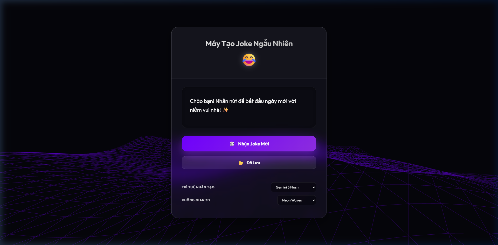
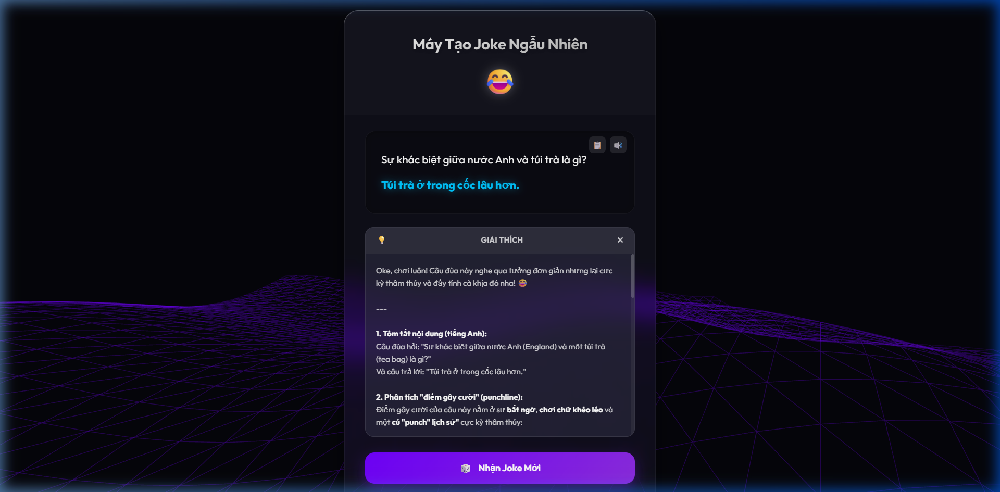
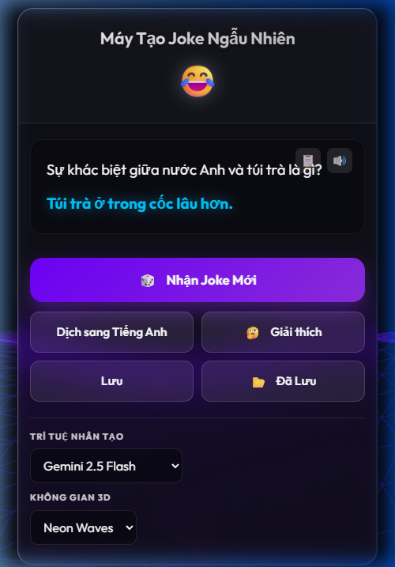

# 🎭 Joke Generator AI - Premium Web Experience

[](https://joke-generator-one-sand.vercel.app/)
[]()

Một ứng dụng web tinh tế kết hợp giữa dữ liệu hài hước từ **JokeAPI** và trí tuệ nhân tạo **Google Gemini AI** để không chỉ mang lại tiếng cười mà còn cung cấp những góc nhìn sâu sắc về văn hóa đằng sau mỗi câu đố.

---

## 📸 Demo & Screenshots

<p align="center">
  
  <br>
  <i>Giao diện chính với phong cách Modern Dark Mode & Glassmorphism</i>
</p>

<table align="center">
  <tr>
    <td align="center"><b>Giải thích bằng AI (Gemini)</b></td>
    <td align="center"><b>Tối ưu hóa di động (Responsive)</b></td>
  </tr>
  <tr>
    <td></td>
    <td></td>
  </tr>
</table>

---

## 🚀 Tính năng nổi bật (Technical Highlights)

- **AI-Powered Explanations**: Tích hợp **Google Gemini SDK** (với các tùy chọn model 2.5 Flash, 2.0 Flash, Pro) để phân tích ngữ nghĩa, lối chơi chữ (pun) và ngữ cảnh văn hóa của câu đố.
- **Multi-language Support**: Hệ thống tự động dịch thuật kết hợp giữa Google Translate API và prompt engineering để giữ nguyên "chất" hài hước khi chuyển sang tiếng Việt.
- **Modern UI/UX**:
  - Giao diện **Glassmorphism** sang trọng với hiệu ứng ánh sáng động.
  - Hiệu ứng **Typing Animation** cho punchline nhằm tăng tính bất ngờ.
  - Hệ thống Background Mesh gradient chuyển động mượt mà.
- **Persistence**: Lưu trữ cấu hình người dùng (Model AI, Theme) qua **LocalStorage**.
- **Edge Deployment**: Triển khai trên **Vercel** với kiến trúc **Serverless Functions** để xử lý các tác vụ AI phía backend bảo mật và hiệu quả.

---

## 🛠️ Stack Công Nghệ

| Layer | Technology |
| :--- | :--- |
| **Frontend** | Vanilla JavaScript (ES6+), HTML5 Semantic, CSS3 (Custom Variables, Flexbox/Grid) |
| **AI Engine** | Google Gemini Generative AI (SDK v1.x) |
| **Backend/Functions** | Node.js (Vercel Serverless Functions) |
| **API Integration** | JokeAPI (REST), Google Translate API |
| **Infrastructure** | Vercel (CI/CD, Edge Network) |

---

## 🏗️ Kiến trúc Hệ thống (System Architecture)

Dự án được thiết kế theo mô hình tách biệt mối quan tâm (**Separation of Concerns**):

1.  **Frontend Logic (`script.js`)**: Quản lý State của ứng dụng, tương tác DOM và điều phối các yêu cầu API.
2.  **Serverless Layer (`api/explain.js`)**: Đóng vai trò làm Proxy để giao tiếp với Google Gemini API, đảm bảo bảo mật cho API Key và tối ưu hóa Payload trả về cho Client.
3.  **UI Components**: Module hóa CSS để dễ dàng bảo trì và tối ưu SEO.

---

## 💻 Hướng dẫn Cài đặt & Chạy Locally

### Prerequisites
- Node.js (phiên bản 18+ khuyến nghị)
- Một API Key từ [Google AI Studio](https://aistudio.google.com/)

### Các bước thực hiện
1. **Clone project:**
   ```bash
   git clone https://github.com/TienxDun/joke-generator.git
   cd joke-generator
   ```
2. **Cấu hình môi trường:** Tạo file `.env` tại thư mục gốc:
   ```env
   GEMINI_API_KEY=your_actual_api_key_here
   ```
3. **Cài đặt & Chạy:**
   ```bash
   npm install        # Cài đặt serverless dependencies
   npm run build     # Chạy script build để tổng hợp tài nguyên
   npm start         # Khởi động server local (mặc định port 3000)
   ```

---

## 🤝 Liên hệ & Đóng góp
Dự án được phát triển bởi **TienxDun**. Mọi ý kiến đóng góp hoặc cơ hội hợp tác xin vui lòng liên hệ qua:

- **GitHub**: [@TienxDun](https://github.com/TienxDun)
- **Email**: [leutiendung.hht@gmail.com](mailto:leutiendung.hht@gmail.com)

---
*Copyright © 2026 TienxDun. Licensed under the MIT License.*

